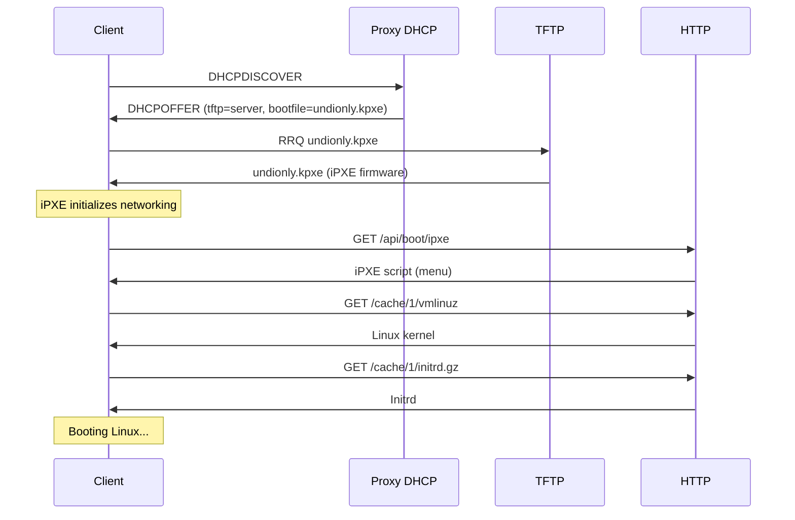

# Boot Modes

PXE network booting involves a chain of firmware → bootloader → kernel. LightBoot handles this chain automatically for BIOS, UEFI x64, and UEFI ARM64 clients.

---

## PXE Boot Chain



---

## Client Architectures

### BIOS (Legacy x86)

- **Detection**: DHCP Option 93 = `0x0000`
- **Boot file served**: `undionly.kpxe`
- **Firmware**: iPXE compiled for UNDI (Universal Network Device Interface)
- **Memory**: 16-bit real mode → 32-bit protected mode transition

Most older hardware and virtual machines in BIOS mode use this path.

### UEFI x64

- **Detection**: DHCP Option 93 = `0x0007`
- **Boot file served**: `ipxe.efi`
- **Firmware**: iPXE compiled as a 64-bit UEFI application
- **Memory**: Direct 64-bit boot, no mode switching

Modern servers, desktops, and VMs with UEFI firmware use this path.

### UEFI ARM64

- **Detection**: DHCP Option 93 = `0x000B`
- **Boot file**: `ipxe.efi` (ARM64 build, currently same filename)
- **Status**: Supported but less tested — feedback welcome

Raspberry Pi 4/5, AWS Graviton, and other ARM64 servers with UEFI firmware.

---

## Architecture Detection

LightBoot inspects DHCP Option 93 (Client System Architecture) from the DHCPDISCOVER packet:

| Option 93 Value | Architecture | Boot File |
|----------------|-------------|-----------|
| `0x0000` | BIOS x86 | `undionly.kpxe` |
| `0x0001` | NEC/PC98 | Not supported |
| `0x0002` | EFI Itanium | Not supported |
| `0x0003` | DEC Alpha | Not supported |
| `0x0004` | Arc x86 | Not supported |
| `0x0005` | Intel Lean Client | Not supported |
| `0x0006` | EFI IA32 | Not supported |
| `0x0007` | EFI x64 | `ipxe.efi` |
| `0x0008` | EFI Xscale | Not supported |
| `0x0009` | EFI BC | Not supported |
| `0x000A` | EFI ARM32 | Not supported |
| `0x000B` | EFI ARM64 | `ipxe.efi` |

> If an unsupported architecture is detected, LightBoot still responds but logs a warning. The client will likely fail to boot.

---

## Boot File Details

### undionly.kpxe (BIOS)

- iPXE compiled with UNDI driver only
- Uses the PXE stack provided by the client's NIC
- Smaller binary (~60 KB)
- Requires the NIC's PXE ROM to be functional

### ipxe.efi (UEFI x64)

- iPXE compiled as a 64-bit UEFI application
- Uses UEFI Simple Network Protocol
- Larger binary (~1 MB)
- Works with any UEFI-compatible NIC

### snponly.efi

- Alternative UEFI build using SNP (Simple Network Protocol) only
- May be more compatible with some firmware implementations
- Place in `bootfiles/` if needed — the default `ipxe.efi` is recommended first

---

## iPXE Script Generation

Once iPXE loads, it requests the boot menu from `http://<server>:8080/api/boot/ipxe`. LightBoot generates an iPXE script based on the detected architecture.

### Example Script (BIOS)

```ipxe
#!ipxe
set menu-timeout 15000
set menu-default 1

menu LightBoot — Select an OS to Boot
item ubuntu Ubuntu 24.04.1 Server (amd64)
item debian Debian 12 Bookworm (amd64)
item shell  iPXE Shell
choose --timeout ${menu-timeout} --default ${menu-default} selected
goto ${selected}

:ubuntu
kernel http://192.168.1.10:8080/cache/1/vmlinuz root=/dev/ram0 ramdisk_size=1500000 ip=dhcp
initrd http://192.168.1.10:8080/cache/1/initrd.gz
boot

:debian
kernel http://192.168.1.10:8080/cache/2/vmlinuz root=/dev/ram0 ramdisk_size=1500000 ip=dhcp
initrd http://192.168.1.10:8080/cache/2/initrd.gz
boot

:shell
echo Type 'exit' to return to menu
shell
goto menu
```

### Kernel Command Line

The kernel command line is defined in each [profile](profiles.md) and can include template variables:

- `ip=dhcp` — tells the kernel to configure networking via DHCP
- `root=/dev/ram0` — root filesystem is the initrd
- `url=http://{{.HTTP}}/cache/{{.ID}}/filesystem.squashfs` — additional files for the installer

---

## Advanced Boot Scenarios

### Chainloading From Existing PXE

If you already have a PXE server, you can configure it to chainload LightBoot:

```ipxe
# In your existing iPXE configuration:
chain http://lightboot-server:8080/api/boot/chain
```

The `/api/boot/chain` endpoint returns an iPXE script that redirects to the full menu.

### Boot Menu JSON

For the Web UI preview, LightBoot provides the menu as JSON:

```bash
curl http://localhost:8080/api/boot/menu
```

```json
{
  "items": [
    {
      "label": "Ubuntu 24.04.1 Server (amd64)",
      "kernel_url": "http://192.168.1.10:8080/cache/1/vmlinuz",
      "initrd_url": "http://192.168.1.10:8080/cache/1/initrd.gz",
      "cmdline": "root=/dev/ram0 ramdisk_size=1500000 ip=dhcp"
    }
  ]
}
```

### Fallback Menu

When no ISOs are in `ready` state, LightBoot generates a fallback menu:

```ipxe
#!ipxe
echo LightBoot — No bootable ISOs found
echo
echo Upload ISOs via the web interface at http://192.168.1.10:8080
echo or copy ISO files to the iso/ directory.
echo
shell
```

---

## Testing Boot Modes

### With QEMU (BIOS)

```bash
qemu-system-x86_64 \
  -m 4096 \
  -net nic,model=e1000 \
  -net user,bootfile=http://HOST_IP:8080/api/boot/chain \
  -boot n
```

### With QEMU (UEFI)

```bash
qemu-system-x86_64 \
  -m 4096 \
  -bios /usr/share/OVMF/OVMF_CODE.fd \
  -net nic \
  -net user,bootfile=http://HOST_IP:8080/api/boot/chain \
  -boot n
```

### With VirtualBox

1. Set **System → Boot Order → Network** as first
2. Under **Network → Advanced**, set **Boot File** to `http://HOST_IP:8080/api/boot/chain`
3. For UEFI: enable **System → Enable EFI**

---

## Common Boot Issues

| Symptom | Likely Cause | Solution |
|---------|-------------|----------|
| Client doesn't reach iPXE | DHCP proxy not running | Check `dhcp_proxy_enabled: true` in config |
| iPXE loads but no menu | HTTP server unreachable | Verify `http_address` and firewall |
| Menu appears, boot fails | Kernel/initrd path wrong | Check cache directory and profile paths |
| Kernel panic on boot | Wrong architecture kernel | Verify ISO matches client architecture |
| "No bootable ISOs" message | ISOs still processing | Wait for status to become `ready` |

See [Troubleshooting](troubleshooting.md) for detailed debugging steps.
