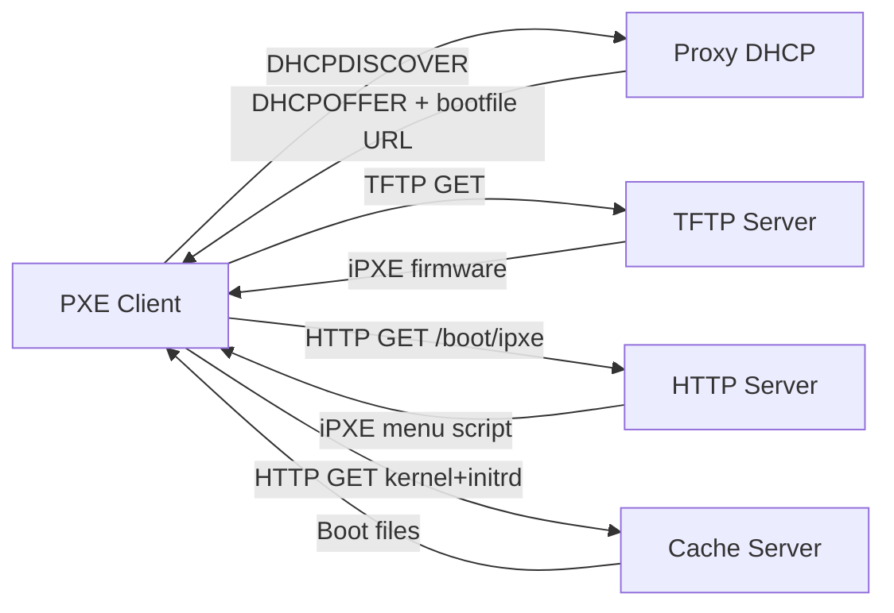

# Welcome to LightBoot

**LightBoot** is a lightweight, zero‑dependency PXE network boot manager. Drop your ISO files into a directory, and LightBoot automatically detects, extracts, and serves them as bootable menu entries — all from a single binary with an embedded web interface.

## How It Works

- **Stage 1 — Proxy DHCP**: Answers PXE clients without conflicting with your network's DHCP server
- **Stage 2 — TFTP**: Serves iPXE firmware based on client architecture (BIOS, UEFI x64, UEFI ARM64)
- **Stage 3 — HTTP Boot**: Provides the iPXE menu script and kernel/initrd files extracted from your ISOs
- **Auto‑Detection**: Profiles automatically recognize Ubuntu, Debian, Fedora, Arch, Alpine, and more

## Key Features

| Feature | Description |
|---------|-------------|
| &#x1f4e6; **Single Binary** | No dependencies, no runtime, just download and run |
| &#x1f50d; **Auto Detection** | Built-in profiles for 6+ distributions |
| &#x1f310; **Web UI** | Vue.js SPA for managing ISOs, viewing logs, and previewing menus |
| &#x1f4ca; **Live Logs** | Server-Sent Events (SSE) stream for real-time monitoring |
| &#x1f510; **API Token** | Secure Bearer token authentication for the management API |
| &#x1f5c4;&#xfe0f; **ISO Caching** | Extracts kernels and initrds once, serves them fast |

## Quick Start

1. **Download** the latest binary from [GitHub Releases](https://github.com/shniranjan/lightboot/releases)
2. **Run** `./lightboot` — the API token is printed on first start
3. **Open** `http://localhost:8080` in your browser and log in with the token
4. **Upload** your ISO files or drop them into the `iso/` directory
5. **Boot** a PXE client on the same network

## Navigation

Use the sidebar or the tabs above to explore the documentation:

- [Installation](installation.md) — setup guide for all platforms
- [Configuration](configuration.md) — every option explained
- [ISO Management](iso-management.md) — uploading, deleting, and managing ISOs
- [Profiles](profiles.md) — how auto-detection works and how to write custom profiles
- [Boot Modes](boot-modes.md) — BIOS vs UEFI, Secure Boot, ARM64
- [Networking](networking.md) — DHCP proxy architecture and port requirements
- [API Reference](api-reference.md) — full REST API documentation
- [Secure Boot](secure-boot.md) — shim.efi, MOK enrollment, and signed binaries
- [Troubleshooting](troubleshooting.md) — common issues and solutions
- [Contributing](contributing.md) — how to add profiles, report bugs, and contribute code

---

*LightBoot v0.1.0 — GPLv2 Licensed*