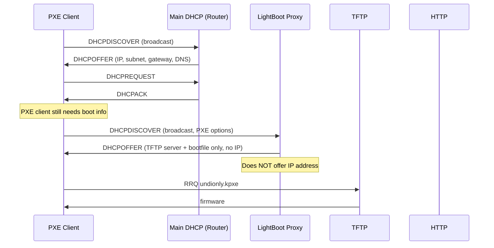

# Networking

LightBoot runs three network services: HTTP, TFTP, and a Proxy DHCP server. Understanding the network architecture is essential for deployment, especially in environments with existing DHCP servers.

---

## Service Overview

| Service | Protocol | Default Port | Requires Privileges | Purpose |
|---------|----------|-------------|---------------------|--------|
| HTTP | TCP | 8080 | No | Web UI, API, boot scripts, cached files |
| TFTP | UDP | 69 | Port 69 (<1024) | Initial iPXE firmware delivery |
| Proxy DHCP | UDP | 67 | Yes (`CAP_NET_BIND_SERVICE`) | PXE client discovery |

---

## Proxy DHCP Architecture

LightBoot's DHCP proxy is **not a full DHCP server**. It does not assign IP addresses. Instead, it answers only PXE-specific DHCP options while leaving IP address assignment to your existing DHCP server.

### How It Works



### Key Behaviours

- **Only responds to PXE clients**: Checks for DHCP Option 60 (Class Identifier = "PXEClient")
- **Does not offer IP addresses**: The `yiaddr` field is `0.0.0.0`
- **Does not override existing offers**: If another DHCP server has already offered an IP, LightBoot doesn't interfere
- **Uses raw sockets**: Binds to `0.0.0.0:67` to receive broadcast DHCPDISCOVER packets

### Why This Approach

- **Safe for existing networks**: Won't break your current DHCP infrastructure
- **No split-scope config needed**: Router/firewall DHCP can coexist
- **Works with any DHCP server**: ISC DHCP, dnsmasq, router DHCP, Windows Server DHCP

---

## Port Requirements

### Inbound (LightBoot listens on)

| Port | Protocol | Source | Required |
|------|----------|--------|----------|
| 67 | UDP | Any PXE client (broadcast) | For automatic PXE boot |
| 69 | UDP | Any PXE client | For TFTP firmware delivery |
| 8080 | TCP | PXE clients + web browsers | For boot scripts, cache, Web UI |

### Outbound (LightBoot initiates)

LightBoot does not initiate any outbound connections. All traffic is responses to client requests.

---

## Firewall Configuration

### UFW (Ubuntu/Debian)

```bash
sudo ufw allow 67/udp comment "LightBoot DHCP proxy"
sudo ufw allow 69/udp comment "LightBoot TFTP"
sudo ufw allow 8080/tcp comment "LightBoot HTTP"
sudo ufw reload
```

### firewalld (RHEL/Fedora)

```bash
sudo firewall-cmd --permanent --add-port=67/udp
sudo firewall-cmd --permanent --add-port=69/udp
sudo firewall-cmd --permanent --add-port=8080/tcp
sudo firewall-cmd --reload
```

### iptables

```bash
sudo iptables -A INPUT -p udp --dport 67 -j ACCEPT
sudo iptables -A INPUT -p udp --dport 69 -j ACCEPT
sudo iptables -A INPUT -p tcp --dport 8080 -j ACCEPT
sudo iptables-save > /etc/iptables/rules.v4  # persist
```

### Docker

When running in Docker, use `--network host` to avoid NAT issues with DHCP broadcast traffic:

```bash
docker run --network host --cap-add NET_BIND_SERVICE lightboot
```

If you can't use host networking, port mapping works for HTTP and TFTP, but **DHCP proxy will not function** (broadcast packets can't be received through Docker's NAT).

---

## Network Topology

### Recommended: Flat Network

```
┌─────────────────────────────────────────┐
│              LAN (192.168.1.0/24)        │
│                                          │
│  ┌──────────┐  ┌──────────┐  ┌────────┐ │
│  │ Router/  │  │ LightBoot│  │ PXE    │ │
│  │ DHCP     │  │ Server   │  │ Client │ │
│  │ .1       │  │ .10      │  │ .100   │ │
│  └──────────┘  └──────────┘  └────────┘ │
└─────────────────────────────────────────┘
```

All devices on the same broadcast domain. DHCPDISCOVER broadcasts reach both the router and LightBoot. This is the simplest and most reliable topology.

### VLAN / Segmented Network

```
┌─────────────┐     ┌─────────────┐
│  VLAN 10    │     │  VLAN 20    │
│  (Clients)  │     │  (Servers)  │
│             │     │             │
│  PXE Client │     │  LightBoot  │
│  Router DHCP│     │             │
└─────────────┘     └─────────────┘
         │                 │
         └────────┬────────┘
              IP Helper
          (DHCP Relay)
```

If PXE clients and LightBoot are on different subnets, you need a **DHCP relay / IP Helper** that forwards DHCP broadcasts across VLANs. Most managed switches and routers support this.

#### Example: Cisco IP Helper

```
interface Vlan10
  ip helper-address 192.168.20.10  # LightBoot IP
```

#### Example: Linux DHCP Relay (dhcrelay)

```bash
sudo dhcrelay -i eth0.10 192.168.20.10
```

---

## IP Address Binding

LightBoot detects the server's IP address automatically and embeds it in:

- iPXE scripts (HTTP URLs for kernel/initrd)
- DHCPOFFER packets (TFTP server name)
- Boot menu JSON responses

By default, it uses the IP of the interface matching the default route. If the server has multiple interfaces, bind to a specific one using:

```yaml
http_address: "192.168.1.10"
tftp_address: "192.168.1.10"
dhcp_proxy_address: "192.168.1.10"
```

---

## Testing Network Connectivity

### From the Server

```bash
# Check HTTP is listening
curl http://localhost:8080/api/health
# {"status":"ok"}

# Check TFTP is listening
echo -ne "\x00\x01undionly.kpxe\x00octet\x00" | timeout 2 nc -u localhost 69 | wc -c

# Check DHCP proxy is listening
sudo ss -ulpn | grep 67
# UNCONN 0 0 0.0.0.0:67 0.0.0.0:* users:(("lightboot",pid=1234,fd=5))
```

### From a Client Machine

```bash
# Test HTTP
curl http://SERVER_IP:8080/api/health

# Test TFTP
tftp SERVER_IP -c get undionly.kpxe

# Test DHCP (requires tcpdump on server)
sudo tcpdump -i any port 67 or port 68 -v
# Look for DHCPDISCOVER from the client's MAC address
```

### Wireshark Capture

Filter for PXE boot traffic:

```
dhcp or tftp or http
```

Check for:
1. DHCPDISCOVER from client (should see it on the server)
2. DHCPOFFER from LightBoot (check Option 66 and 67 are set)
3. TFTP Read Request for `undionly.kpxe`
4. HTTP GET for `/api/boot/ipxe`
5. HTTP GET for `/cache/*` kernel and initrd

---

## Common Network Issues

| Symptom | Cause | Solution |
|---------|-------|----------|
| Client can't reach LightBoot | Different subnet / VLAN | Use IP helper or flatten network |
| Client gets DHCPOFFER but no TFTP | Firewall blocking port 69 | Allow UDP 69 |
| TFTP works but no menu | Firewall blocking port 8080 | Allow TCP 8080 |
| DHCP proxy won't start | Missing privileges | `sudo setcap cap_net_bind_service=+ep ./lightboot` |
| "Address already in use" on port 67 | Another DHCP server on same machine | Stop conflicting service or bind to specific IP |
| Docker DHCP not working | Docker NAT blocks broadcast | Use `--network host` |
| Slow TFTP transfers | Network congestion | TFTP is inherently slow; ensure client is on LAN |

---

## IPv6

LightBoot currently supports IPv4 only. IPv6 PXE boot (DHCPv6 + HTTP Boot) is on the roadmap for Stage 9+. Until then, ensure your PXE clients are configured for IPv4 PXE boot.
