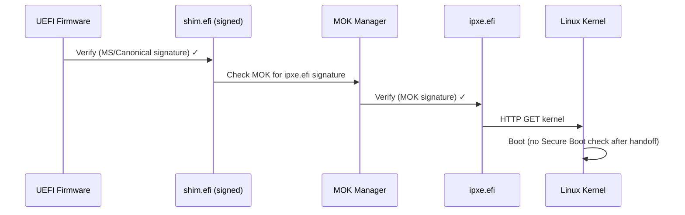

# Secure Boot

Secure Boot is a UEFI firmware feature that ensures only cryptographically signed code runs during the boot process. This page covers how LightBoot handles Secure Boot and how to configure your environment.

---

## How Secure Boot Affects PXE

When Secure Boot is enabled on a client:

1. The UEFI firmware verifies the PXE bootloader signature before execution
2. `ipxe.efi` (unsigned) will be **rejected** — the client won't boot
3. A signed shim (`shim.efi`) must be used as a first-stage bootloader
4. The shim loads a Machine Owner Key (MOK) enrolled by the administrator
5. After MOK enrollment, `ipxe.efi` can be verified and executed

### Boot Chain with Secure Boot



---

## Required Files

To support Secure Boot, you need these files in your `bootfiles/` directory:

| File | Purpose | Source |
|------|---------|--------|
| `shim.efi` | Signed first-stage bootloader | Ubuntu/Debian `shim-signed` package |
| `mmx64.efi` | MOK Manager (for key enrollment) | Same package as shim |
| `ipxe.efi` | Your signed iPXE binary | Build and sign yourself |

### Getting shim.efi

**From Ubuntu**:
```bash
apt download shim-signed
dpkg-deb -x shim-signed*.deb /tmp/shim/
cp /tmp/shim/usr/lib/shim/shimx64.efi ./bootfiles/shim.efi
cp /tmp/shim/usr/lib/shim/mmx64.efi ./bootfiles/
```

**From Debian**:
```bash
apt download shim-signed
dpkg-deb -x shim-signed*.deb /tmp/shim/
cp /tmp/shim/usr/lib/shim/shimx64.efi.signed ./bootfiles/shim.efi
```

**From Fedora**:
```bash
dnf download shim-x64
rpm2cpio shim-x64*.rpm | cpio -idmv
cp boot/efi/EFI/fedora/shimx64.efi ./bootfiles/shim.efi
```

---

## Signing iPXE

### 1. Build iPXE

```bash
git clone https://github.com/ipxe/ipxe.git
cd ipxe/src
make bin-x86_64-efi/ipxe.efi
```

### 2. Generate a MOK (Machine Owner Key)

```bash
# Generate a signing key
openssl req -new -x509 -newkey rsa:2048 -subj "/CN=LightBoot MOK/" \
  -keyout MOK.key -out MOK.crt -days 3650 -nodes -sha256

# Convert to DER format (required by mokutil)
openssl x509 -in MOK.crt -out MOK.der -outform DER
```

### 3. Sign iPXE

```bash
# Sign the EFI binary with sbsign (from sbsigntools)
sbsign --key MOK.key --cert MOK.crt --output ipxe-signed.efi bin-x86_64-efi/ipxe.efi

# Copy to bootfiles
cp ipxe-signed.efi ./bootfiles/ipxe.efi
```

Install `sbsigntools`:
```bash
# Ubuntu/Debian
sudo apt install sbsigntool

# Fedora
sudo dnf install sbsigntools
```

---

## MOK Enrollment

Before a client with Secure Boot can network-boot, the MOK must be enrolled in the firmware:

### Enroll via MOK Manager (Manual)

1. Place `MOK.der` on a FAT32 USB drive
2. Boot the client, enter UEFI firmware settings
3. Navigate to **Secure Boot → MOK Management → Enroll Key From Disk**
4. Select the USB drive and `MOK.der`
5. Confirm enrollment and reboot

### Enroll via mokutil (When Linux Is Already Installed)

```bash
# Import the key
sudo mokutil --import MOK.der
# You'll be prompted for a password

# Reboot — MOK Manager will appear
sudo reboot
# Follow the prompts to enroll the key

# Verify enrollment
sudo mokutil --list-enrolled | grep "LightBoot"
```

---

## Testing Secure Boot

### Check Client Status

```bash
# On a running Linux client
mokutil --sb-state
# SecureBoot enabled
# SetupMode: user (keys enrolled)
```

### Test with QEMU + OVMF

```bash
# Boot with Secure Boot enabled OVMF
qemu-system-x86_64 \
  -m 4096 \
  -bios /usr/share/OVMF/OVMF_CODE.secboot.fd \
  -net nic \
  -net user,bootfile=http://HOST_IP:8080/api/boot/chain \
  -boot n
```

If you see a "Verification failed" error, the MOK hasn't been enrolled or the signature is invalid.

---

## Fallback Mode

LightBoot can serve different bootloaders based on whether the client requests Secure Boot:

| Client Type | Boot File Served |
|-------------|-----------------|
| BIOS | `undionly.kpxe` |
| UEFI (Secure Boot OFF) | `ipxe.efi` (unsigned OK) |
| UEFI (Secure Boot ON) | `shim.efi` → `ipxe.efi` (signed) |

> **Current Status**: LightBoot always serves `ipxe.efi` for UEFI clients. Secure Boot-aware selection is planned for a future release. For now, if your clients use Secure Boot, manually replace `ipxe.efi` with your signed copy.

---

## Troubleshooting Secure Boot

| Symptom | Cause | Solution |
|---------|-------|----------|
| "Verification failed: (0x1A) Security Violation" | Unsigned bootloader | Sign ipxe.efi or disable Secure Boot |
| shim.efi loads but ipxe fails | MOK not enrolled | Enroll MOK.der in firmware |
| "Invalid signature detected" | Signature mismatch | Re-sign with correct key |
| MOK Manager doesn't appear | mmx64.efi missing | Copy mmx64.efi to bootfiles/ |
| "Image failed to verify with *ACCESS DENIED*" | shim policy restriction | Check shim version and MOK status |

---

## Future: Automated MOK Enrollment

A future release of LightBoot will support:

- Auto-detection of Secure Boot-enabled clients
- Auto-serving of shim.efi + signed ipxe.efi
- Pre-built signed iPXE binaries (via community trusted keys)
- Documentation for using Microsoft-signed shim from the Linux Vendor Firmware Service

---

## Resources

- [iPXE Secure Boot Guide](https://ipxe.org/appnote/etoken)
- [Shim Project](https://github.com/rhboot/shim)
- [Ubuntu Secure Boot Documentation](https://wiki.ubuntu.com/UEFI/SecureBoot)
- [Linux Vendor Firmware Service](https://www.lvfs.li) — for obtaining Microsoft-signed shims
